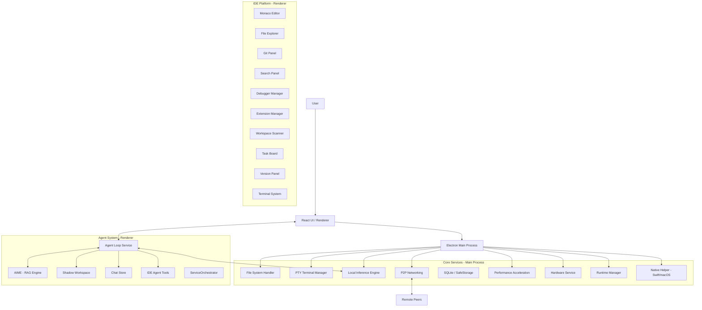

# Kalynt Architecture Documentation

## 1. System Overview

Kalynt is a **Local-First, AI-Native IDE**. Unlike traditional IDEs that bolt on AI as a plugin, Kalynt integrates the LLM directly into the editor's event loop, creating a bi-directional "Agentic" workflow. It is built as a monorepo with Electron (main process), React 18 (renderer), and shared packages for CRDT, networking, and native platform acceleration.

### High-Level Diagram

---

## 2. Core Services (Electron Main Process)

### 2.1. Performance Acceleration System

A dedicated multi-module system for optimizing resource usage across the application.

| Module | File | Purpose |
|---|---|---|
| **MemoryAccelerator** | `MemoryAccelerator.ts` | Periodic GC scheduling, memory pressure handling, performance mode management (balanced/high-perf/power-saver), renderer GC dispatch, native helper trimming |
| **IOAccelerator** | `IOAccelerator.ts` | LRU-cached directory scanning and file metadata, native FSEvents delegation on macOS |
| **ComputeAccelerator** | `ComputeAccelerator.ts` | Process priority management, native compute offloading |
| **BuildAccelerator** | `BuildAccelerator.ts` | Optimized build pipeline coordination |
| **Performance Index** | `index.ts` | Unified IPC handler registration for all accelerators |

**RAM Optimization Flags (main.ts):**
- V8: `--expose_gc`, `--optimize_for_size`, `--max-old-space-size=256`, `--lite-mode`
- Chromium: `--in-process-gpu`, `--disable-gpu-compositing`, `--disable-background-networking`, `CalculateNativeWinOcclusion`
- WebPreferences: `spellcheck: false`, `v8CacheOptions: 'bypassHeatCheck'`, `backgroundThrottling: true`

### 2.2. Hardware Service (`hardware-service.ts`)

Provides real-time system metrics (CPU, RAM, disk, GPU) to the renderer's ResourceMonitor and PerformanceTab components. Delegates to the native Swift helper on macOS for GPU statistics via `system_profiler`.

### 2.3. Runtime Manager (`runtime-manager.ts`)

Manages local LLM model lifecycle: downloading, verifying, loading via `node-llama-cpp`, and inference. Supports GGUF models (Llama 3, Mistral, CodeQwen, etc.) with automatic hardware detection for CPU/GPU offloading.

### 2.4. Native Helper Service (`native-helper-service.ts`)

JSON-RPC bridge to the platform-specific native helper process. Provides:
- **macOS (Swift):** FSEvents file watching, CoreML inference, hardware stats, `memory-trim` and `llm-unload` RPC for RAM management
- Communication via stdin/stdout JSON-RPC over a spawned child process

### 2.5. Binary Manager (`binary-manager.ts`)

Manages native binary discovery and lifecycle for platform-specific toolchains.

---

## 3. Agent System (Renderer)

### 3.1. Agent Loop Service (`agentLoopService.ts`)

The core engine for AI autonomy. Implements a multi-step ReAct (Reasoning + Acting) loop:
1. **Context Building:** Combines user prompts with RAG context from AIME.
2. **Context Window Management:** `trimToContextWindow` prunes older messages when nearing token limits. Tool results are truncated at 4000 characters.
3. **Inference:** Sends context to local or cloud LLMs with exponential backoff retry (3 attempts).
4. **Tool Parsing:** Parses responses for structured tool calls.
5. **Execution:** `ideAgentTools` executes commands via Electron IPC.
6. **Self-Correction:** Validates changes in a Shadow Workspace and feeds errors back to the agent.

### 3.2. Agent Service (`agentService.ts`)

Higher-level orchestration layer over the agent loop. Provides:
- **Background Analysis:** Quick `analyze()` mode that bypasses the full ReAct loop for non-actionable suggestions.
- **Model-Tier Instruction Controllers:** Generates model-specific prompts based on tier (small, large, flagship).
- **Multi-Provider Support:** OpenAI (GPT-4o), Anthropic (Claude 3.5 Sonnet), Google (Gemini 1.5 Pro), and local models.

### 3.3. IDE Agent Tools (`ideAgentTools.ts`)

The tool-call executor. Implements 66 KB of IDE automation commands that the agent can invoke:
- `writeFile`, `readFile`, `deleteFile` — File operations with path sanitization
- `terminal.execute` — Shell command execution
- `searchFiles`, `searchInFiles` — Workspace search
- `createFolder`, `renameFile` — File management
- Language-specific code execution and testing

### 3.4. AIME (AI Memory Engine) (`aimeService.ts`)

Long-term memory and semantic code search:
- **Indexing:** Spawns a Web Worker to index the codebase into vector embeddings. Worker is terminated after indexing to free the V8 isolate.
- **Retrieval:** Semantic search via `fuse.js` for RAG context injection.
- **Persistence:** IndexedDB-backed storage for cross-session retention.
- **Symbol Extraction:** Parses functions, classes, imports across 10+ languages.

### 3.5. Shadow Workspace (`shadowWorkspaceService.ts`)

Safety sandbox for AI-proposed changes:
1. Agent proposes a code change.
2. System creates a temporary "shadow" file.
3. Linter/Compiler validates the shadow file.
4. If valid, change is applied to real code. If invalid, error is fed back for self-correction.

### 3.6. Service Orchestrator (`ServiceOrchestrator.ts`)

Manages lazy loading and lifecycle of heavy services to minimize RAM. Services (`aiService`, `collabEngine`, `integrationService`, `versionControlService`) are only initialized when first requested and can be hibernated to free memory.

---

## 4. IDE Platform (Renderer)

### 4.1. Monaco Editor Integration

- **Core Editor:** `IDEWorkspace.tsx` (76 KB) — Full-featured code editor with multi-tab support, breadcrumbs, split views.
- **Lazy Loading:** Monaco is loaded on-demand via `@monaco-editor/react` loader (not statically imported).
- **Model Lifecycle:** Text models are explicitly disposed on tab close to free V8 heap.
- **Inline AI:** `InlineEditWidget.tsx` for AI-powered inline code edits.

### 4.2. IDE Components

| Component | File | Capabilities |
|---|---|---|
| **File Explorer** | `FileExplorer.tsx` (38 KB) | Tree view, drag-and-drop, context menus, file operations |
| **Git Panel** | `GitPanel.tsx` (40 KB) | Staging, committing, branch management, diff viewing |
| **Search Panel** | `SearchPanel.tsx` (34 KB) | Full-text search, regex, file filtering |
| **Terminal** | `Terminal.tsx` + 12 submodules | Xterm.js-based terminal with split views, search, context menus |
| **Command Palette** | `CommandPalette.tsx` (12 KB) | Fuzzy-matched command execution |
| **Breadcrumbs** | `Breadcrumbs.tsx` | File path navigation |
| **Debugger** | `DebuggerManager.tsx` | Runtime debugging with breakpoints and inspection |

### 4.3. Panel System

| Panel | File | Purpose |
|---|---|---|
| **Unified Agent Panel** | `UnifiedAgentPanel.tsx` (139 KB) | Chat, agentic loop visualization, collaboration, history |
| **Unified Settings** | `UnifiedSettingsPanel.tsx` (38 KB) | Central settings with glassmorphism UI, "Danger Zone" |
| **Model Manager** | `ModelManager.tsx` (22 KB) | Download, manage, and configure local LLM models |
| **AIME Settings** | `AIMESettings.tsx` (22 KB) | Configure the AI memory engine indexing and retrieval |
| **Task Board** | `TaskBoard.tsx` (21 KB) | Project task management |
| **Version Panel** | `VersionPanel.tsx` (22 KB) | Diff viewer using Monaco DiffEditor |
| **Files Panel** | `FilesPanel.tsx` (16 KB) | File listing with metadata |
| **Plugins Panel** | `PluginsPanel.tsx` (48 KB) | Extension marketplace and management |
| **Performance Tab** | `PerformanceTab.tsx` (12 KB) | Real-time CPU, RAM, disk monitoring |
| **Resource Monitor** | `ResourceMonitor.tsx` (19 KB) | Compact header resource meters |
| **Workspace Scanner** | `WorkspaceScanTab.tsx` (20 KB) | Security and code quality scanning |

---

## 5. Collaboration System

### 5.1. P2P Service (`p2pService.ts`)

- **Protocol:** `simple-peer` (WebRTC) + `y-webrtc`
- **Topology:** Mesh network
- **Conflict Resolution:** CRDTs via Yjs ensure eventual consistency
- **Encryption:** AES-256-GCM on all data channels
- **Signaling:** STUN/TURN relay (no payload access by server)

### 5.2. Supporting Services

| Service | Purpose |
|---|---|
| `collabEngine.ts` (13 KB) | Yjs document management and sync orchestration |
| `encryptedProvider.ts` (13 KB) | Encrypted Yjs provider for secure document sync |
| `encryptionService.ts` (14 KB) | AES-256-GCM encryption/decryption primitives |
| `peerAuthService.ts` (12 KB) | Peer authentication and authorization |
| `memberSyncService.ts` (28 KB) | Member presence, cursors, and state synchronization |
| `fileTransferService.ts` (18 KB) | Secure file transfer between peers |

---

## 6. Security Architecture

| Layer | Implementation |
|---|---|
| **Process Isolation** | `contextIsolation: true`, `nodeIntegration: false`, `sandbox: true` |
| **Content Security Policy** | Strict CSP headers applied via `session.webRequest.onHeadersReceived` |
| **API Key Storage** | Electron `safeStorage` (OS keychain) — never stored in plain text |
| **Path Traversal** | `validatePath` sanitizer with symlink resolution on all FS operations |
| **Extension Sandbox** | Extensions run in a forked Node.js process (`ExtensionHostProcess`) |
| **Update Integrity** | GitHub token validation + checksum verification (`updateIntegrityService.ts`) |
| **Audit Logging** | `auditLogService.ts` (14 KB) — security event tracking |

---

## 7. State Management

Six Zustand stores with persistence:

| Store | Purpose |
|---|---|
| `appStore.ts` (12 KB) | App-wide state: current workspace, theme, startup, settings |
| `chatStore.ts` (3 KB) | Chat session persistence |
| `memberStore.ts` (17 KB) | Collaboration member tracking |
| `modelStore.ts` (12 KB) | LLM model inventory and configuration |
| `notificationStore.ts` (1 KB) | Notification queue |
| `updateStore.ts` (10 KB) | Auto-update state machine |

---

## 8. Monorepo Package Structure

| Package | Purpose |
|---|---|
| **`apps/desktop`** | Main Electron application (renderer + main process) |
| **`packages/crdt`** | Shared Yjs-based CRDT logic for conflict resolution |
| **`packages/networking`** | Low-level WebRTC connection management |
| **`packages/shared`** | Common types, interfaces, and utilities |
| **`packages/native-macos`** | Swift native helper for macOS (FSEvents, CoreML, memory management) |

---

## 9. Technology Standards

| Area | Technology |
|---|---|
| **Language** | TypeScript (Strict Mode) |
| **Bundler** | Vite (Fast HMR) |
| **Runtime** | Electron 28 |
| **Editor** | Monaco Editor (VS Code core) |
| **Styling** | CSS Variables + Glassmorphism aesthetic |
| **Icons** | Lucide React |
| **IPC** | Context-bridged `window.electronAPI` (secure, no node integration in renderer) |
| **Terminal** | Xterm.js + node-pty |
| **Testing** | Shadow Workspace validation |

---

*Last updated: Wednesday, February 19, 2026*
