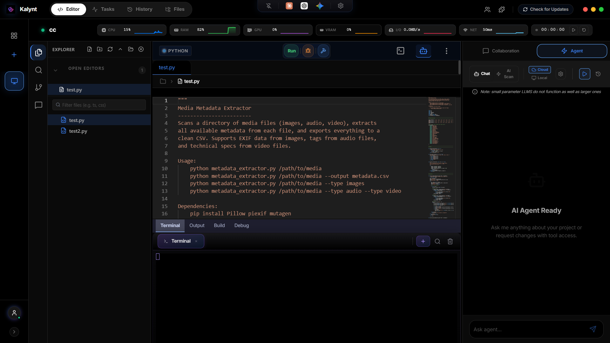
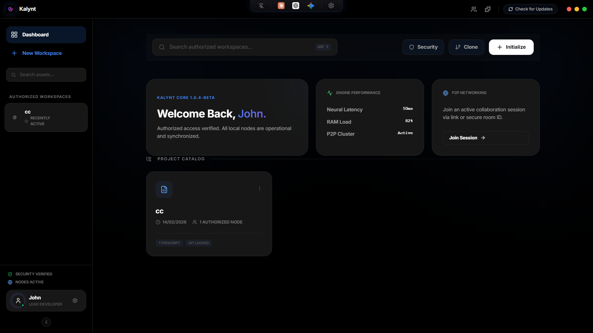
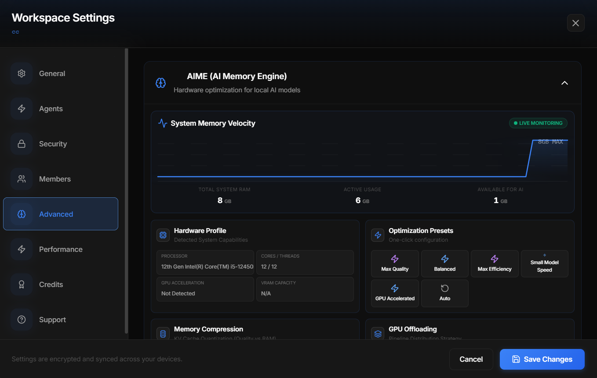
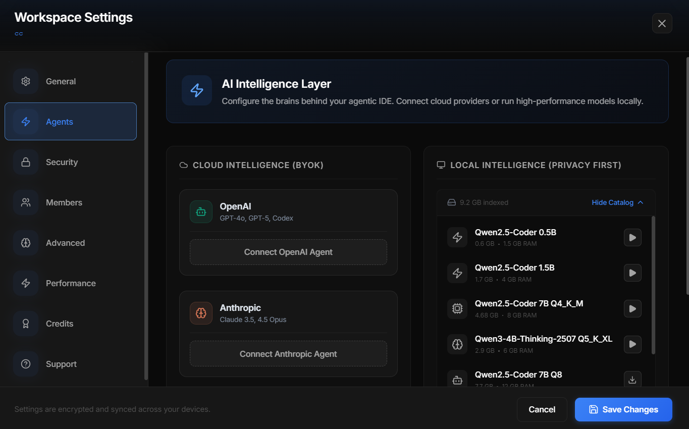
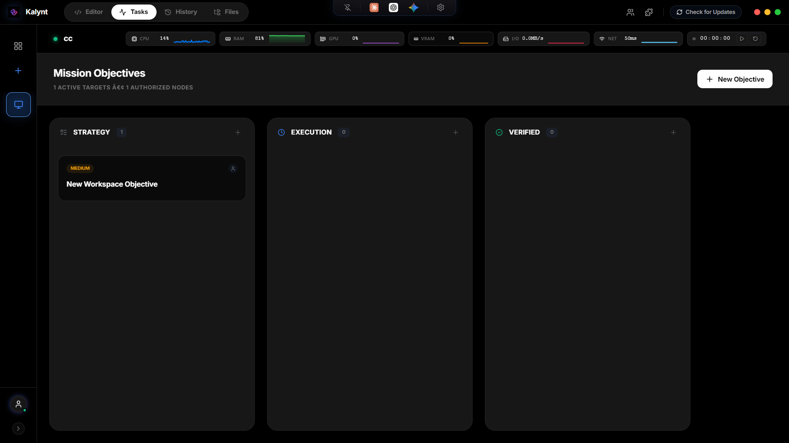
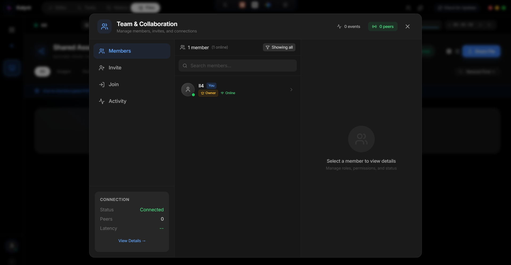
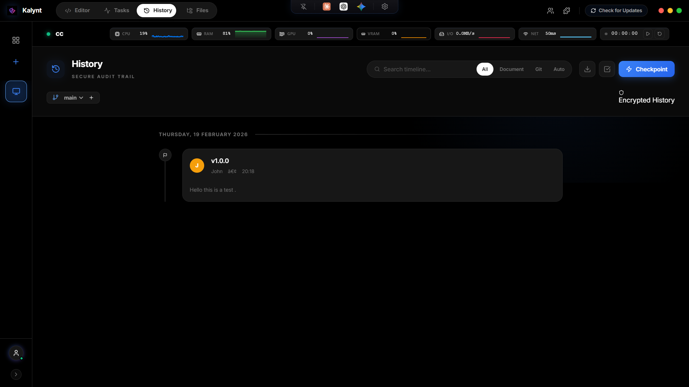
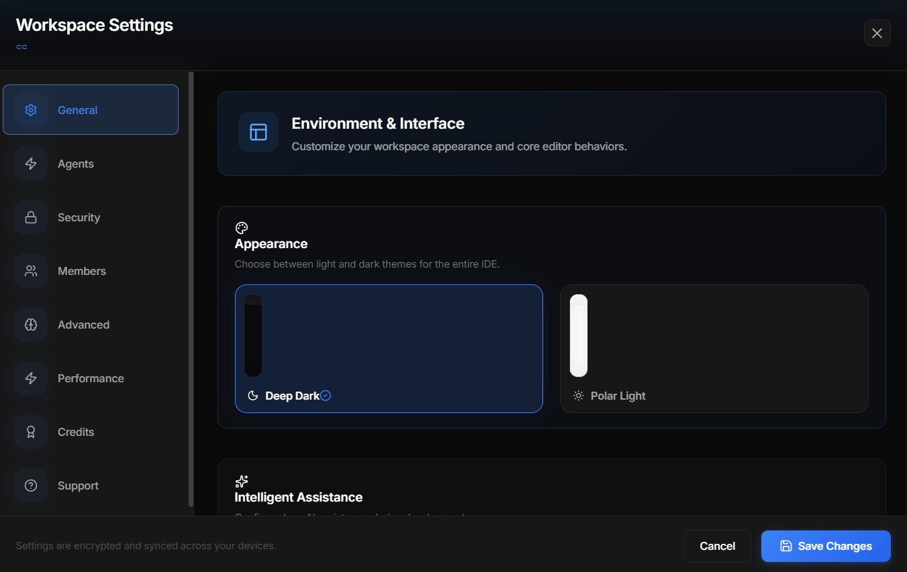
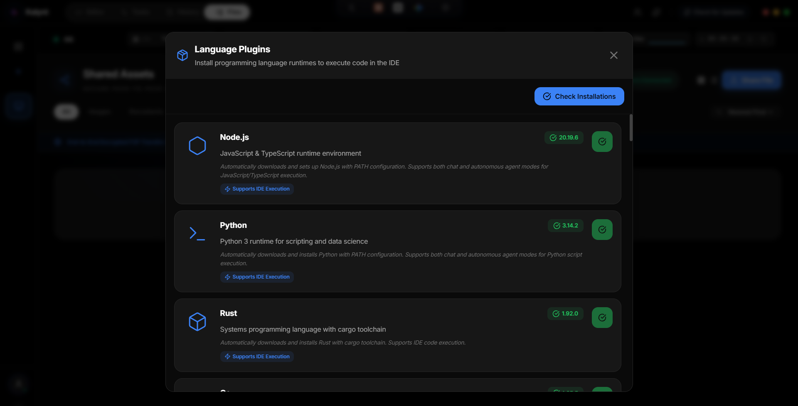

# Kalynt - The Privacy-First AI IDE

<div align="center">
  
  
  <h3>Local-First AI. End-to-End Encrypted Collaboration. No Subscription Required.</h3>

  <p>
    Kalynt is a next-generation Integrated Development Environment designed for the post-GPT era. 
    It embeds an autonomous AI agent deeply into your workflow while ensuring your code never leaves your machine unless you want it to.
  </p>

  [](https://www.gnu.org/licenses/agpl-3.0)
  [](https://github.com/Hermes-Lekkas/Kalynt/releases)
  [](https://github.com/Hermes-Lekkas/Kalynt/releases)
</div>

---

<div align="center">
  
</div>

<details>
  <summary><b>📷 Click to view more screenshots</b></summary>

  ### Dashboard
  

  ### Artificial Intelligence Memory Engine (AIME)
  

  ### Multi-Agent Workflows
  

  ### Project Task Board
  

  ### P2P Collaboration & Team Sync
  

  ### Smart P2P File Share
  

  ### Version History & Diff Viewer
  

  ### Comprehensive Settings & Model Manager
  

  ### Built-in Language Support
  

</details>

## Key Features

### Autonomous AI Agent (AIME)
*   **Local Inference:** Run LLMs (Llama 3, Mistral, CodeQwen) directly on your CPU/GPU using `node-llama-cpp`. No internet required.
*   **Agentic Loop:** An autonomous ReAct (Reasoning + Acting) loop that can plan, execute terminal commands, edit files, and fix bugs without hand-holding.
*   **Shadow Workspace:** AI changes are sandboxed and validated in a temporary "shadow" environment before touching your real code.
*   **Cloud Fallback:** Seamlessly switch to OpenAI (GPT-4o), Anthropic (Claude 3.5 Sonnet), or Google (Gemini 1.5 Pro) when you need extra horsepower.
*   **RAG Engine:** AIME indexes your entire codebase semantically, allowing the agent to retrieve relevant context for complex tasks.
*   **Model Manager:** Download, manage, and configure local GGUF models directly from the IDE.
*   **50+ Language Support:** Expanded file extension coverage including TypeScript, Python, Go, Rust, Java, C/C++, C#, Ruby, PHP, Swift, and more.

### Agentic AI System (New in v1.0.5)
A comprehensive architecture overhaul with 26 new services enabling autonomous decision-making and intelligent task execution:

*   **Transaction Service:** ACID-compliant file operations with shadow file system and commit/rollback support
*   **Cycle Detection:** Automatic detection and breaking of infinite loops in agent execution with randomized backoff
*   **Tool Cache:** LRU cache with TTL invalidation and file dependency tracking for automatic cache invalidation
*   **Goal Stack:** Hierarchical task planning with goal decomposition, dependency management, and plan persistence
*   **Intent Classification:** 14 task categories (code generation, debugging, refactoring, etc.) with intelligent routing
*   **Confidence Scoring:** Tool performance tracking with historical success rates and auto-approval for high-confidence operations
*   **Learning Service:** Correction history database with pattern matching for similar errors and adaptive tool selection
*   **Symbol Service:** Comprehensive symbol relationship tracking with impact analysis for refactoring
*   **Semantic Operations:** High-level refactoring (extract method, rename symbol, move symbol) with automatic reference updates
*   **Parallel Execution:** Concurrent tool execution with dependency analysis, topological sorting, and resource conflict detection
*   **Context Assembly:** Priority-based context management with token budget management and intelligent deduplication
*   **Token Optimization:** Context window optimization with compression strategies and conversation window management

### Privacy & Security by Design
*   **Local-First:** Your code, chat history, and vector embeddings live strictly on your disk.
*   **P2P Collaboration:** Serverless, end-to-end encrypted (AES-256-GCM) collaboration using CRDTs and WebRTC. No central server sees your keystrokes.
*   **Process Isolation:** Renderer sandboxing (`contextIsolation`, `sandbox: true`), strict Content Security Policy headers, and no `nodeIntegration`.
*   **API Key Security:** Keys stored via Electron's `safeStorage` (OS keychain) — never in plain text.
*   **Path Protection:** All file operations pass through `validatePath` with symlink resolution.
*   **Update Integrity:** GitHub token validation and checksum verification for all updates.
*   **Security Scanning:** Integrated workspace scanner for code quality and vulnerability detection.
*   **Audit Logging:** Security event tracking via `auditLogService`.
*   **Safe JSON Parsing:** Type-safe JSON handling infrastructure with validation and error recovery.
*   **Shell Injection Prevention:** PID and port validation with parameterized commands to prevent injection attacks.
*   **CSP Hardening:** Strengthened Content Security Policy with `object-src 'none'`, `base-uri 'self'`, and `frame-ancestors 'none'` directives.

### Full-Featured IDE
*   **Monaco Editor:** The battle-tested core of VS Code, with AI inline completions and model-aware editing.
*   **Integrated Terminal:** Xterm.js-based terminal with split views, search, context menus, and smart command suggestions.
*   **Git Integration:** Full Git panel with staging, committing, branch management, and diff viewing.
*   **File Explorer:** Tree view with drag-and-drop, context menus, and file operations.
*   **Search Panel:** Full-text and regex search across the workspace.
*   **Command Palette:** Fuzzy-matched command execution.
*   **Debugger:** Integrated runtime debugging with breakpoints and inspection using VS Code's official js-debug-dap adapter.
*   **Task Board:** Project task management directly in the IDE.
*   **Version History:** Diff viewer for comparing file versions.

### Extension System
*   **VS Code Compatibility:** Implements a subset of the VS Code API for easy extension porting.
*   **Process Isolation:** Extensions run in a forked Node.js process for safety.
*   **Open VSX Support:** Install extensions from the Open VSX marketplace or local `.vsix` files.
*   **Plugin Management:** Full-featured panel for discovering, installing, and managing extensions.

### Shadow Workspace with LSP (v1.0.5)
*   **Sandboxed Validation:** AI changes are tested in a temporary "shadow" environment before touching your real code
*   **LSP Integration:** Automatic Language Server Protocol session startup with real-time diagnostics validation
*   **Multi-Language Support:** Comprehensive language ID mapping for LSP compatibility across all major languages
*   **Document Synchronization:** Real-time document change synchronization with language servers

### Performance Acceleration
*   **Memory Optimization:** Multi-layer RAM reduction system (Chromium flags, V8 heap cap, idle GC loops, lazy loading) achieving ~450 MB idle on Windows.
*   **Lazy Loading:** Monaco Editor, tab panels, and heavy services load on-demand via `React.lazy()` and `ServiceOrchestrator`.
*   **Native Acceleration:** Swift native helper on macOS for FSEvents, CoreML, and memory management.
*   **Performance Modes:** Balanced, High Performance, and Power Saver profiles.
*   **Real-Time Monitoring:** CPU, RAM, disk, and network metrics in the header and a dedicated Performance tab.

### Real-Time Collaboration
*   **P2P Sync:** Yjs CRDTs over WebRTC data channels — no central server.
*   **Encrypted Channels:** AES-256-GCM encryption on all collaboration data.
*   **Presence:** Real-time cursor positions, selections, and member awareness.
*   **File Transfer:** Secure peer-to-peer file sharing.

### Modern UI/UX
*   **Glassmorphism Aesthetic:** Sleek, modern interface with depth and transparency effects.
*   **Theme System:** Full Light and Dark mode support with CSS variable-based theming.
*   **Resizable Panels:** Draggable Terminal, File Explorer, and Agent Sidebar with state persistence.
*   **Notification System:** Toast notifications with priority levels.
*   **Auto-Updates:** Built-in update system with integrity verification.

---

## Compatibility & Testing

Kalynt is a cross-platform application:

*   **Windows:** **Extensively Tested.** Full support for local LLM acceleration (CUDA/DirectML) and native PTY. v1.0.5 includes ESM loader fix for Windows absolute paths (C:\) in AI engine loading.
*   **Linux (Ubuntu/Debian):** **Extensively Tested.** Optimized for modern distributions (Ubuntu 24.04+). Includes stability fixes for Wayland and transparency.
*   **macOS:** **Supported.** Apple Silicon (M1/M2/M3) with Swift native performance helper for FSEvents, CoreML, and memory management.

---

## Architecture

Kalynt is built on a robust, modern tech stack:

*   **Runtime:** Electron 40 (Main Process), Chromium (Renderer)
*   **Frontend:** React 18, Vite, TypeScript (Strict Mode)
*   **Editor:** Monaco Editor (VS Code core)
*   **State Management:** Zustand (w/ Persistence), Yjs (CRDT for collaboration)
*   **AI Engine:** `node-llama-cpp` (Local), OpenAI/Anthropic/Google (Cloud)
*   **Agentic System:** 26 autonomous services for intelligent task execution
*   **Terminal:** Xterm.js + node-pty
*   **Styling:** CSS Variables + Glassmorphism aesthetic
*   **Icons:** Lucide React
*   **Security:** Context-bridged IPC, CSP, renderer sandbox, safeStorage
*   **Database:** Better-sqlite3 v12.6 for local data persistence

See [ARCHITECTURE.md](./ARCHITECTURE.md) for a deep dive into the system design.

### Monorepo Structure

```text
kalynt/
├── apps/
│   └── desktop/                 # Main Electron application
│       ├── electron/            # Main process (services, IPC, native)
│       │   └── services/
│       │       └── Performance_Acceleration/
│       └── src/                 # Renderer (React UI, services, stores)
│           ├── components/      # 23 top-level + ide/ + collaboration/ + extensions/
│           ├── services/        # 54+ renderer services (including 26 agentic AI services)
│           └── stores/          # 6 Zustand stores
├── packages/
│   ├── crdt/                    # Shared Yjs CRDT logic
│   ├── networking/              # P2P WebRTC management
│   ├── shared/                  # Common types and utilities
│   └── native-macos/            # Swift native helper (FSEvents, CoreML, memory)
└── ...
```

---

## Installation

### Pre-built Binaries
Download the latest installer for Windows, macOS, or Linux from the [Releases Page](https://github.com/Hermes-Lekkas/Kalynt/releases).

### Building from Source

```bash
# Prerequisites: Node.js >= 22, Python 3.10+, C++ Build Tools
git clone https://github.com/Hermes-Lekkas/Kalynt.git
cd Kalynt
npm install
npm run dev
```

For macOS native helper:
```bash
cd packages/native-macos
swift build -c release
```

---

## Contributing

We welcome contributions! Please see [CONTRIBUTING.md](./CONTRIBUTING.md) for guidelines on how to submit PRs, report bugs, and request features.

---

## Security

Kalynt is built on a "Trust No One" (Zero Trust) architecture. See [SECURITY.md](./SECURITY.md) for the full security policy, vulnerability reporting, and recent security updates.

---

## Licensing

Kalynt is free and open-source software licensed under the **GNU Affero General Public License v3.0 (AGPL-3.0)**.

Files marked with `SPDX-License-Identifier: AGPL-3.0-only` are free to use, modify, and distribute under the terms of the AGPL.

Copyright (c) 2026 Hermes Lekkas (hermeslekkasdev@gmail.com).
