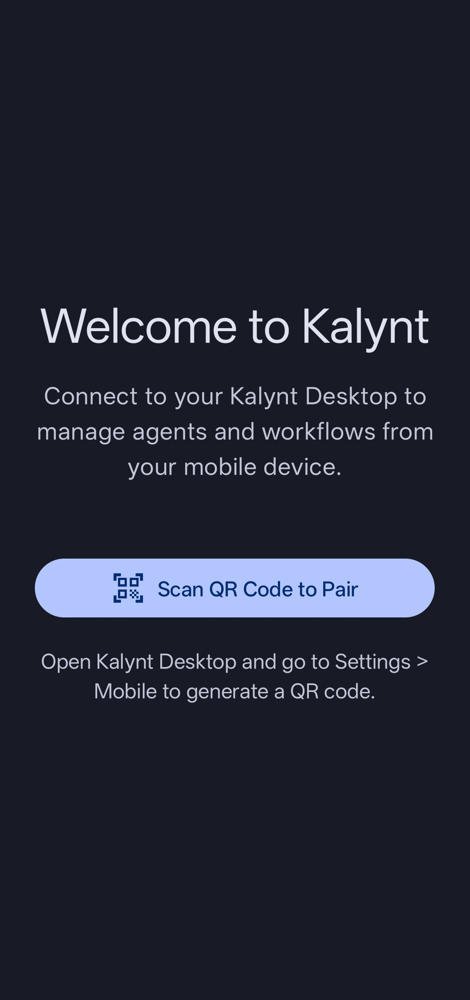

# Kalynt Mobile Companion

<div align="center">
  
  
  <h3>Remote Management for Your Kalynt Workspace</h3>

  <p>
    
  </p>

  <p>
    <strong>⚠️ EARLY DEVELOPMENT PREVIEW ⚠️</strong><br>
    This app is actively being developed. Expect bugs, crashes, and incomplete features.<br>
    Use at your own risk — your feedback helps us improve!
  </p>

  <p>
    The official Android companion app for Kalynt IDE. Manage your agents, monitor execution, 
    and control your development workflow from anywhere — with zero-cost, peer-to-peer connectivity.
  </p>

  [](https://www.gnu.org/licenses/agpl-3.0)
  [](https://github.com/Hermes-Lekkas/Kalynt/releases)
  [](https://f-droid.org/)
</div>

---

> **⚠️ IMPORTANT: SEPARATE PROJECT NOTICE**
> 
> Kalynt Mobile Companion is a **separate project** from Kalynt Desktop IDE. They share this repository for coordinated development, but:
> - **Built independently** — Desktop uses npm/esbuild, Mobile uses Gradle
> - **Distributed separately** — Desktop installers ≠ Mobile APKs
> - **No bundled dependencies** — Desktop builds don't include mobile code, and vice versa
> - **Work together** via peer-to-peer WebSocket connection when both are running
> 
> 📖 **For the Desktop IDE, see [README.MD](./README.MD)**

---

## What is Kalynt Mobile Companion?

Kalynt Mobile Companion is a **remote control center** for your Kalynt Desktop IDE. It allows you to:

- 📱 **Monitor Agents** — View real-time agent execution status from your phone
- 🚀 **Dispatch Commands** — Send tasks to your desktop agents remotely
- 📊 **Track Progress** — Monitor task completion, errors, and output
- 🔔 **Receive Notifications** — Get push notifications when agents complete tasks or need attention
- 🔄 **Manage PRs** — Review, approve, and merge GitHub pull requests on the go
- 📴 **Offline Queue** — Queue commands while offline; they execute when reconnected
- 🔒 **Zero-Server Security** — All communication is peer-to-peer encrypted; no cloud servers involved

---

## Key Features

### 🌐 Peer-to-Peer Connectivity
- **Zero Server Costs** — No backend infrastructure required
- **WebSocket Direct** — Connects directly to your desktop instance via local network
- **End-to-End Encryption** — ECDH key exchange + AES-256-GCM for all communications
- **QR Code Pairing** — Simple, secure pairing by scanning a QR code from your desktop

### 🤖 Agent Management
- View all running agents and their current state
- Send new commands to agents with custom parameters
- Monitor execution progress in real-time
- View agent output logs and error messages
- Cancel or pause running agent tasks

### 📬 Push Notifications
- Get notified when agents complete tasks
- Receive alerts for errors or failures
- GitHub PR notifications (when configured)
- Custom notification channels for different event types

### 🔄 Offline Support
- Queue commands while away from your desktop
- Automatic synchronization when connection restored
- Persistent storage using Room database
- Background sync with WorkManager

### 🔐 Security First
- **No Cloud Storage** — Your data never leaves your devices
- **GitHub Token Proxy** — Desktop proxies all GitHub API calls; tokens never touch mobile
- **Root Detection** — App warns on rooted/jailbroken devices
- **Certificate Pinning** — Prevents MITM attacks
- **Anti-Tampering** — Runtime integrity checks

---

## Architecture

### Monorepo Context

```text
kalynt/
├── apps/
│   ├── desktop/                 # Kalynt Desktop IDE (SEPARATE PROJECT)
│   │   └── electron/            # Main process with mobile bridge
│   │       ├── mobileBridge.ts  # WebSocket server for mobile
│   │       └── mobileAgentBridge.ts  # Agent command proxy
│   │
│   └── mobile/                  # Kalynt Mobile Companion (THIS PROJECT)
│       └── android/             # Kotlin/Jetpack Compose
│           ├── app/src/main/java/com/kalynt/mobile/
│           │   ├── p2p/         # WebSocket client, connection manager
│           │   ├── security/    # Pairing, encryption, Keystore
│           │   ├── github/      # GitHub proxy client
│           │   ├── local/       # Room DB, offline queue
│           │   └── ui/          # Jetpack Compose screens
│           └── ...
```

### Technology Stack

| Layer | Technology |
|-------|------------|
| **Language** | Kotlin 2.0 |
| **UI Framework** | Jetpack Compose (Material 3) |
| **Networking** | OkHttp + Java-WebSocket |
| **Cryptography** | BouncyCastle (ECDH, AES-GCM) |
| **Database** | Room (SQLite) |
| **DI** | Koin |
| **Background** | WorkManager |
| **QR Scanning** | ZXing |
| **Build** | Gradle 8.9 |

### Communication Flow

```
┌─────────────────────────────────────────────────────────────┐
│                    KALYNT MOBILE (Android)                  │
│  ┌─────────────┐    ┌──────────────┐    ┌────────────────┐  │
│  │  Jetpack    │◄──►│   P2P Web    │◄──►│  Secure Token  │  │
│  │  Compose UI │    │   Socket     │    │   Storage      │  │
│  └─────────────┘    └──────────────┘    └────────────────┘  │
│           ▲                │                                 │
│           │                ▼                                 │
│  ┌────────┴─────┐    ┌──────────────┐                       │
│  │   Room DB    │    │   GitHub     │                       │
│  │ Offline Queue│    │ Proxy Client │                       │
│  └──────────────┘    └──────────────┘                       │
└───────────────────────────┬─────────────────────────────────┘
                            │ WebSocket (Local Network)
                            ▼
┌─────────────────────────────────────────────────────────────┐
│                    KALYNT DESKTOP (Electron)                │
│  ┌──────────────┐    ┌──────────────┐    ┌────────────────┐  │
│  │ Mobile Bridge│◄──►│  Agent System│◄──►│   AIME Engine  │  │
│  │  (WS Server) │    │              │    │                │  │
│  └──────────────┘    └──────────────┘    └────────────────┘  │
│           │                │                                 │
│           │                ▼                                 │
│           │         ┌──────────────┐                        │
│           └────────►│ GitHub Proxy │◄──► GitHub API         │
│                     │ (Token Safe) │    (Token NEVER on     │
│                     └──────────────┘     mobile device)      │
└─────────────────────────────────────────────────────────────┘
```

---

## Installation

> **⚠️ DEVELOPMENT BUILD WARNING**
> 
> This is an **early development preview**. The app may:
> - Crash unexpectedly (especially during QR scanning)
> - Lose connection to desktop
> - Have incomplete UI elements
> - Drain battery faster than expected
> 
> **DO NOT use for production work.** Report bugs to help us improve!

### Requirements
- Android 8.0+ (API 26)
- Local network access (WiFi) for P2P connection
- Kalynt Desktop v1.0.5+ running on the same network

### Download Options

#### F-Droid (Recommended)
Coming soon to F-Droid for automatic updates and open-source verification.

#### GitHub Releases
Download the APK from the [Releases Page](https://github.com/Hermes-Lekkas/Kalynt/releases).

#### Build from Source
```bash
# Prerequisites: Android SDK, JDK 17
export ANDROID_HOME=~/android-sdk
export JAVA_HOME=~/jdk-17

cd apps/mobile/android
./gradlew assembleDebug

# APK location:
# apps/mobile/android/app/build/outputs/apk/debug/app-debug.apk
```

---

## Setup & Pairing

### 1. Enable Mobile Bridge on Desktop
```bash
# In Kalynt Desktop, go to Settings → Mobile Companion
# Click "Generate QR Code" to start the mobile bridge server
```

### 2. Pair Your Device
1. Open Kalynt Mobile app
2. Tap "Scan to Connect"
3. Scan the QR code displayed on your desktop
4. Confirm the pairing code matches on both devices

### 3. Start Using
- View connected desktop status on the Dashboard
- Send commands to agents from the Agents tab
- Monitor GitHub PRs from the GitHub tab
- Configure notification preferences in Settings

---

## Development

### Project Structure
```
apps/mobile/android/
├── app/
│   ├── build.gradle.kts           # App dependencies
│   ├── proguard-rules.pro         # ProGuard configuration
│   └── src/main/
│       ├── AndroidManifest.xml
│       ├── java/com/kalynt/mobile/
│       │   ├── KalyntApp.kt       # Application class + Koin DI
│       │   ├── p2p/
│       │   │   ├── DesktopConnectionManager.kt  # WebSocket client
│       │   │   └── P2PMessage.kt                # Message protocol
│       │   ├── security/
│       │   │   ├── PairingManager.kt           # QR pairing flow
│       │   │   ├── SecureTokenStorage.kt       # Keystore encryption
│       │   │   └── QRScannerActivity.kt        # QR code scanning
│       │   ├── github/
│       │   │   └── GitHubProxyClient.kt        # GitHub API via desktop
│       │   ├── local/
│       │   │   ├── database/
│       │   │   │   ├── AppDatabase.kt          # Room database
│       │   │   │   └── PendingCommandDao.kt    # Command DAO
│       │   │   └── CommandSyncManager.kt       # Offline sync
│       │   └── ui/
│       │       ├── KalyntApp.kt                # Navigation host
│       │       ├── dashboard/
│       │       ├── agents/
│       │       ├── github/
│       │       └── settings/
│       └── res/                   # Resources, layouts, themes
└── build.gradle.kts               # Project-level config
```

### Building

```bash
# Debug build
./gradlew assembleDebug

# Release build (requires signing config)
./gradlew assembleRelease

# Run tests
./gradlew test

# Install on connected device
./gradlew installDebug
```

### Testing

```bash
# Unit tests
./gradlew testDebugUnitTest

# Instrumented tests (requires device/emulator)
./gradlew connectedAndroidTest
```

---

## Security Considerations

### Threat Model

| Threat | Mitigation |
|--------|------------|
| Eavesdropping | ECDH key exchange + AES-256-GCM encryption |
| MITM | Certificate pinning + QR code visual verification |
| Token Theft | GitHub tokens NEVER stored on mobile; proxied through desktop |
| Replay Attacks | 5-minute timestamp validation on pairing tokens |
| Device Compromise | Android Keystore for token storage; root detection |
| Offline Data | Room DB encrypted at rest on supported devices |

### Security Checklist for Developers
- [ ] Never hardcode API keys or secrets
- [ ] Use SecureTokenStorage for all credentials
- [ ] Validate all P2P message signatures
- [ ] Check for root/jailbreak before sensitive operations
- [ ] Keep BouncyCastle library updated

---

## Troubleshooting

### Known Issues (Development Preview)
| Problem | Status | Workaround |
|---------|--------|------------|
| App crashes when tapping "Scan to Connect" | 🔴 High Priority | Ensure camera permission is granted. If it still crashes, restart the app and try again |
| QR scanner doesn't open | 🟡 Investigating | Check that your device has a working camera and ZXing dependencies are installed |
| Connection drops after pairing | 🟡 Investigating | Both devices must stay on the same WiFi network |

### Connection Issues
| Problem | Solution |
|---------|----------|
| "Cannot connect to desktop" | Ensure both devices are on the same WiFi network |
| "Pairing failed" | Regenerate QR code on desktop; check time sync |
| "Connection dropped" | Check firewall settings; ensure port 5210 is open |

### Build Issues
| Problem | Solution |
|---------|----------|
| "SDK not found" | Set `ANDROID_HOME` environment variable |
| "JDK version mismatch" | Use JDK 17: `export JAVA_HOME=~/jdk-17` |
| "Dependency resolution failed" | Run `./gradlew clean` and retry |

---

## Contributing

This project follows the same contribution guidelines as Kalynt Desktop. See [CONTRIBUTING.md](./CONTRIBUTING.md).

When submitting PRs for mobile:
- Test on physical Android devices (not just emulator)
- Follow Kotlin style guidelines
- Include UI tests for new screens
- Update this README for new features

---

## License

Kalynt Mobile Companion is free and open-source software licensed under the **GNU Affero General Public License v3.0 (AGPL-3.0)**.

Copyright (c) 2026 Hermes Lekkas (hermeslekkasdev@gmail.com).

---

## Related Projects

- **[Kalynt Desktop](./README.MD)** — The main IDE (this Mobile app is a companion to it)
- **[ARCHITECTURE.md](./ARCHITECTURE.md)** — System-wide architecture documentation
- **[SECURITY.md](./SECURITY.md)** — Security policy and vulnerability reporting

---

<div align="center">
  <p><strong>Kalynt Mobile Companion</strong> — Your workspace, in your pocket.</p>
  <p>🔒 Zero-server. Zero-cost. Fully private.</p>
</div>